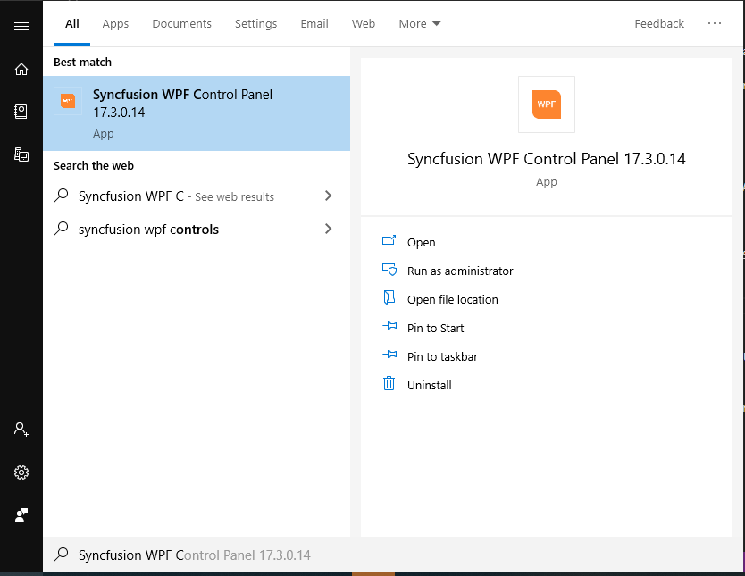
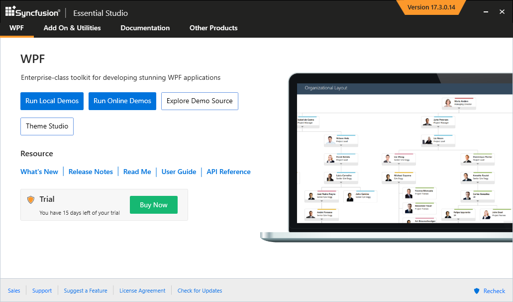
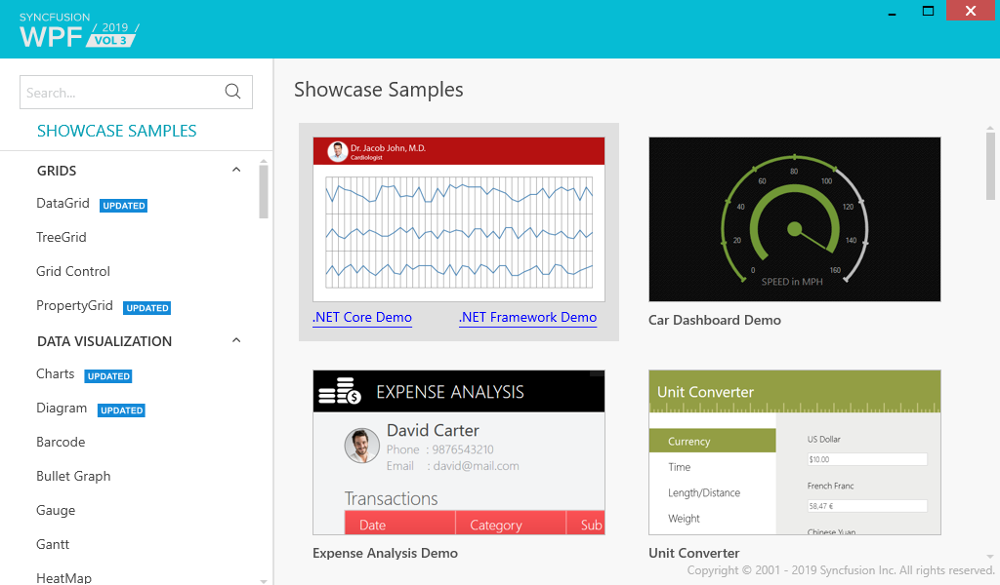
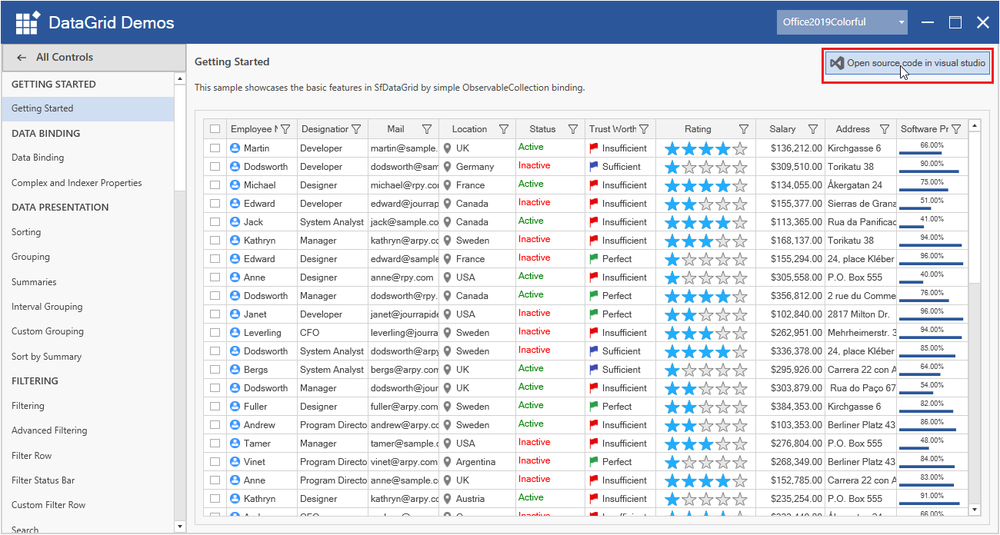
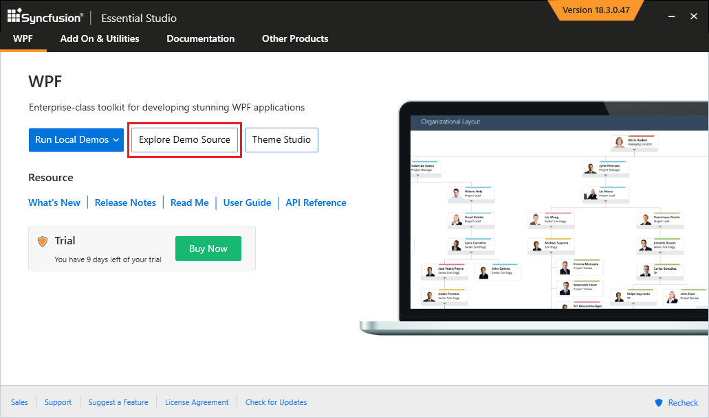

# Featured Samples for Syncfusion<sup>&reg;</sup> WPF Controls

## Prerequisites

* **Essential Studio<sup>&reg;</sup> for WPF** must be installed. See the [Installation](Installation/) topic for setup steps.
* To open sample source from the Sample Browser, a supported edition of **Visual Studio** must be installed. See [System Requirements](System-Requirements.md) for supported versions.
* Running samples requires a **Syncfusion runtime license key**. See [Licensing](Licensing/) for details on registering a license key.
* The offline and online samples target either **.NET Framework** or **.NET** (formerly .NET Core). Refer to the [Syncfusion WPF release notes](Release-notes/) for the specific framework versions supported by each sample set.

## Syncfusion<sup>&reg;</sup> WPF Controls Panel

To explore Syncfusion<sup>&reg;</sup> WPF controls and components, open the **Syncfusion WPF Controls Panel** by typing "Syncfusion WPF" in the Windows Start menu search and clicking the matching result.



Alternatively, open the Control Panel from the following installed location:

```
C:\Program Files (x86)\Syncfusion\Essential Studio\WPF\{{ site.releaseversion }}\Infrastructure\Launcher\Syncfusion WPF Control Panel.exe
```

N> The path above uses the latest Essential Studio<sup>&reg;</sup> version. Refer to the installed Essential Studio<sup>&reg;</sup> version instead of the one mentioned.



## WPF Sample Browser

To explore the locally installed demos, click `Run Local Demos` and select either **.NET** or **.NET Framework**, which will open the `WPF Sample Browser`.



## Offline Samples

The offline samples are available at the following installed location, where you can make changes and further explore the controls:

```
C:\Users\Public\Documents\Syncfusion\WPF\{{ site.releaseversion }}\
```

The offline samples can also be explored directly from the `Syncfusion<sup>&reg;</sup> WPF Sample Browser` and opened in Visual Studio by running the required sample and selecting `Open source code in Visual Studio`.



N> If a sample fails to load, ensure the file is unblocked (right-click the file > **Properties** > check **Unblock**) and that the target .NET Framework / .NET SDK and Visual Studio version are installed.

### Offline showcase samples

To explore any individual showcase sample from the `Syncfusion<sup>&reg;</sup> WPF Sample Browser`, click `Explore Demo Source` and navigate to the `showcase` folder.



N> To run the individual control demos, refer to the instructions in [Running Individual Control Demos](https://github.com/syncfusion/wpf-demos#running-individual-control-demos).

## Online Samples

Online samples let you explore Syncfusion<sup>&reg;</sup> WPF controls without installing the full WPF Studio. Samples are available from the **Microsoft Store** (installed demo browser) and from the **GitHub repository** (clone and build).

### Microsoft Store demo browser

* Download and install the **.NET Framework** demos from the [Microsoft Store](https://apps.microsoft.com/detail/9n99kdhrff6g?hl=en-US&gl=US).
* After installation completes, launch the installed **Syncfusion WPF Sample Browser** app from the Windows Start menu.

### Download showcase demos from online

You can explore showcase demos from [GitHub WPF demos](https://github.com/syncfusion/wpf-demos/tree/master/showcase).
 See the repository's `README.md` for the required .NET SDK / Visual Studio version.

1. Clone the repository:

    ```
    git clone https://github.com/syncfusion/wpf-demos.git
    ```

2. Open the solution in Visual Studio.
3. Restore NuGet packages (the public nuget.org feed is sufficient).
4. Build and run the desired sample project.
5. Register a Syncfusion runtime license key if prompted — see [Licensing](Licensing/).

### Online showcase samples

You can explore the showcase demos from the [GitHub WPF demos showcase folder](https://github.com/syncfusion/wpf-demos/tree/master/showcase).
